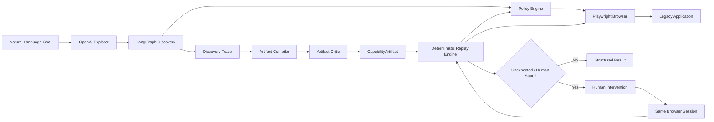

# Banking Agent

An AI-assisted computer-use capability platform that discovers legacy UI workflows with OpenAI + LangGraph, compiles them into reusable typed artifacts, and replays them deterministically with zero LLM decisions.

Discover with AI. Compile into capabilities. Replay deterministically. Escalate safely to humans.

## Why This Project Exists

Many enterprise workflows remain trapped behind legacy UIs without reliable APIs.

Traditional approaches often choose between brittle scripted automation and expensive LLM-driven browser control on every execution. Banking Agent uses a different architecture: AI is used for discovery, successful interaction is compiled into a reusable `CapabilityArtifact`, and production replay uses deterministic browser automation without LLM decision-making.

When automation reaches a state that should not be handled automatically, the system escalates to a human while preserving the same browser session.

## Core Architecture



## What Is Demonstrated

Banking Agent demonstrates a full capability lifecycle:

- Discover a legacy UI workflow from a natural-language goal.
- Compile the successful trace into a typed YAML artifact.
- Critique the artifact before use.
- Replay the artifact deterministically with Playwright.
- Return structured business outcomes for expected domain states.
- Pause and expose a same-session human handoff path for unexpected states.

The validated sample capability looks up a bank member by member ID and returns the current savings balance.

## Repository Map

- `backend/` - FastAPI service, LangGraph discovery, policy checks, compiler, critic, replay, and intervention APIs.
- `demo_bank/` - Local legacy-style demo bank application used for validation.
- `frontend/` - Next.js operator UI for discovery, artifacts, replay, evidence, and intervention flow.
- `artifacts/` - Compiled capability artifacts.
- `evidence/final/` - Final discovery, replay, benchmark, and scenario evidence.
- `tests/` - Backend regression tests.
- `start-banking-agent.ps1` - One-command local launcher.

## API Surface

The backend exposes evaluator-friendly endpoints under `http://127.0.0.1:8001`:

- `GET /api/health`
- `GET /api/capabilities`
- `GET /api/capabilities/{capability_id}`
- `POST /api/capabilities/{capability_id}/replay`
- `POST /api/discovery`
- `GET /api/runs/{run_id}`
- `GET /api/interventions`
- `GET /api/interventions/{intervention_id}`
- `POST /api/interventions/{intervention_id}/take-control`
- `POST /api/interventions/{intervention_id}/resume`
- `POST /api/interventions/{intervention_id}/cancel`

## Validated Results

These numbers come from the checked-in final evidence. They are not projected or invented.

| Area | Validated result | Evidence |
| --- | --- | --- |
| AI discovery | `SUCCESS` for member `M-10428`, returned `$4283.42` | `evidence/final/discovery/discovery_result.json` |
| Discovery model calls | `7` OpenAI calls using `gpt-4o` | `evidence/final/discovery/discovery_result.json` |
| Compiled artifact | `artifacts/member_balance_discovered_v1.yaml` | `evidence/final/discovery/discovery_result.json` |
| Artifact critic | approved, score `0.95` | `evidence/final/discovery/discovery_result.json` |
| Deterministic replay benchmark | 10 / 10 successful runs for `M-10428` | `evidence/final/benchmark/benchmark.json` |
| Replay LLM usage | `0` LLM calls during replay benchmark | `evidence/final/benchmark/benchmark.json` |
| Replay median duration | `1.3175` seconds | `evidence/final/benchmark/benchmark.json` |
| Generalization | `SUCCESS` for `M-77777`, returned `8910.0` | `evidence/final/benchmark/generalization.json` |
| Business outcome: missing member | 3 / 3 returned `MEMBER_NOT_FOUND` for `M-00000` | `evidence/final/benchmark/benchmark.json` |
| Business outcome: permission denied | 3 / 3 returned `PERMISSION_DENIED` for `M-99999` | `evidence/final/benchmark/benchmark.json` |
| Slow-load scenario | 3 / 3 successful runs for `M-77777` | `evidence/final/benchmark/benchmark.json` |

Human handoff was validated to the point of `HUMAN_REQUIRED`, take-control, and paused human ownership in a live browser session. The latest live manual resume was not confirmed in final evidence, so this README does not claim it as a completed live manual pass. Backend regression tests cover the same-session resume behavior.

## Demo Scenarios

Use these member IDs when evaluating:

- `M-10428` - successful replay, current savings balance `$4283.42`.
- `M-77777` - successful generalized replay, current savings balance `8910.0`.
- `M-00000` - expected business outcome: `MEMBER_NOT_FOUND`.
- `M-99999` - expected business outcome: `PERMISSION_DENIED`.
- `M-88888` - human intervention scenario.

## Setup

Requirements:

- Python 3.11+
- Node.js and npm
- Playwright browser dependencies installed for Python
- An OpenAI API key for discovery runs

Create local environment configuration:

```powershell
Copy-Item .env.example .env
```

Then set `OPENAI_API_KEY` in `.env`.

Install dependencies only when needed:

```powershell
python -m pip install -r requirements.txt
cd frontend
npm install
```

## One-Command Launcher

From the repository root:

```powershell
powershell -ExecutionPolicy Bypass -File .\start-banking-agent.ps1
```

The launcher checks whether each service is already listening before starting anything:

- Demo bank: `http://127.0.0.1:8000`
- Backend API: `http://127.0.0.1:8001`
- Frontend: `http://127.0.0.1:3000`

It starts missing services in background processes, redirects logs, and uses strict health-check timeouts so the command returns control instead of waiting indefinitely.

Launcher logs:

- `demo-bank-8000.log`
- `demo-bank-8000.err.log`
- `backend-8001.log`
- `backend-8001.err.log`
- `frontend/frontend-3000.log`
- `frontend/frontend-3000.err.log`

## Running Validation

The final packaging change does not require rerunning the frontend build or the backend regression suite. The previously validated artifacts are stored under `evidence/final/`.

Useful commands when intentionally revalidating:

```powershell
python -m pytest tests/
cd frontend
npm run typecheck
npm run lint
npm run build
```

## Security Notes

- Keep `.env` local and do not commit real API keys.
- Discovery uses the configured OpenAI model.
- Replay executes from compiled artifacts and is designed to use zero LLM calls.
- Policy checks sit in front of browser execution.
- Human intervention is used for states that should not be automated blindly.

## Known Issues / Deliberate Cuts

- This is a local evaluator demo, not a deployed multi-tenant service.
- Human handoff has backend/API support and evidence for pausing into human ownership; the latest live manual resume was not confirmed in final evidence.
- The demo bank is intentionally local and deterministic so evaluator results can be reproduced.
